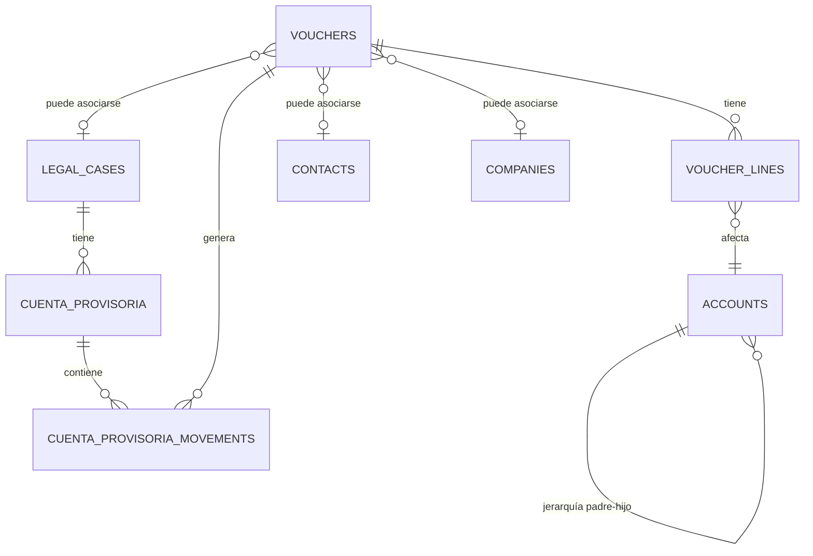

# Módulo Contable - ERP MisCausas

## Resumen Ejecutivo

El Módulo Contable de ERP MisCausas es un sistema completo diseñado específicamente para estudios jurídicos chilenos, implementando el marco contable legal nacional y la funcionalidad especializada de **Cuenta Provisoria** requerida por los tribunales de justicia.

## Arquitectura del Sistema

### Entidades Principales

#### 1. Plan de Cuentas (Chart of Accounts)
```typescript
// Tabla: accounts
interface Account {
  id: number;
  code: string;           // Código contable (ej: "1.1.01.001")
  name: string;           // Nombre de la cuenta
  type: string;           // Tipo: asset, liability, equity, revenue, expense
  category: string;       // Categoría del marco contable chileno
  parentId?: number;      // Cuenta padre para jerarquía
  description?: string;   // Descripción adicional
  isActive: boolean;      // Estado activo/inactivo
  createdAt: Date;
}
```

**Categorías del Marco Contable Chileno:**
- Activos Corrientes
- Activos No Corrientes
- Pasivos Corrientes
- Pasivos No Corrientes
- Patrimonio
- Ingresos de Actividades Ordinarias
- Costos de Ventas
- Gastos de Administración
- Gastos de Ventas
- Resultados Financieros

#### 2. Comprobantes Contables (Vouchers)
```typescript
// Tabla: vouchers
interface Voucher {
  id: number;
  voucherNumber: string;  // Número correlativo automático
  legalCaseId?: number;   // Vinculación opcional con causa legal
  contactId?: number;     // Vinculación con contacto
  companyId?: number;     // Vinculación con empresa
  documentType: string;   // Tipo: factura, boleta, voucher, nota_credito
  folioNumber: string;    // Número de folio del documento
  issueDate: Date;        // Fecha de emisión
  description: string;    // Descripción del comprobante
  comments?: string;      // Comentarios adicionales
  subtotal: number;       // Subtotal antes de impuestos
  taxAmount: number;      // Monto de IVA u otros impuestos
  total: number;          // Total del comprobante
  status: string;         // Estado: pending, paid, posted
  createdAt: Date;
}
```

#### 3. Líneas de Comprobante (Voucher Lines)
```typescript
// Tabla: voucher_lines
interface VoucherLine {
  id: number;
  voucherId: number;      // Referencia al comprobante
  accountId: number;      // Cuenta contable afectada
  description: string;    // Descripción del movimiento
  debitAmount: number;    // Monto del débito
  creditAmount: number;   // Monto del crédito
  createdAt: Date;
}
```

#### 4. Cuenta Provisoria (Specialized for Chilean Legal System)
```typescript
// Tabla: cuenta_provisoria
interface CuentaProvisoria {
  id: number;
  legalCaseId: number;    // Causa legal asociada
  rol: string;            // ROL del tribunal (ej: "C-12345-2024")
  debtorName: string;     // Nombre del deudor
  year: number;           // Año del período
  month: number;          // Mes del período (1-12)
  status: string;         // Estado: draft, approved, submitted
  observations?: string;  // Observaciones adicionales
  createdBy: number;      // Usuario que creó la cuenta
  createdAt: Date;
}
```

#### 5. Movimientos de Cuenta Provisoria
```typescript
// Tabla: cuenta_provisoria_movements
interface CuentaProvisoriaMovement {
  id: number;
  cuentaProvisoriaId: number;  // Referencia a cuenta provisoria
  voucherId?: number;          // Referencia opcional al comprobante origen
  accountId: number;           // Cuenta contable
  description: string;         // Descripción del movimiento
  date: Date;                  // Fecha del movimiento
  debitAmount: number;         // Monto débito
  creditAmount: number;        // Monto crédito
  balance: number;             // Saldo acumulado
  createdAt: Date;
}
```

### Relaciones Entre Entidades



## Flujos de Uso del Sistema

### 1. Configuración Inicial del Plan de Cuentas

1. **Acceder al módulo**: Navegar a Contabilidad → Plan de Cuentas
2. **Crear cuentas padre**: Establecer las categorías principales según el marco chileno
3. **Crear subcuentas**: Definir cuentas específicas bajo cada categoría
4. **Configurar jerarquía**: Asignar relaciones padre-hijo para estructura organizativa

**Ejemplo de estructura:**
```
1. ACTIVOS
  1.1 Activos Corrientes
    1.1.01 Efectivo y Equivalentes
      1.1.01.001 Caja General
      1.1.01.002 Banco Estado Cuenta Corriente
      1.1.01.003 Banco Santander Cuenta Corriente
```

### 2. Gestión de Comprobantes Contables

1. **Crear comprobante**: Navegar a Contabilidad → Comprobantes → Nuevo Comprobante
2. **Completar información básica**:
   - Tipo de documento (factura, boleta, voucher, nota de crédito)
   - Número de folio
   - Fecha de emisión
   - Descripción
3. **Asociar con entidades** (opcional):
   - Causa legal específica
   - Contacto o empresa
4. **Definir montos**:
   - Subtotal
   - IVA u otros impuestos
   - Total
5. **Crear líneas contables**:
   - Seleccionar cuentas afectadas
   - Definir débitos y créditos
   - Verificar que cuadre el balance

### 3. Flujo Completo de Cuenta Provisoria

#### Paso 1: Preparación
1. **Verificar causa legal**: Asegurar que la causa esté registrada en el sistema
2. **Revisar comprobantes**: Confirmar que todos los vouchers del período estén ingresados
3. **Validar cuentas**: Verificar que las cuentas contables estén correctamente configuradas

#### Paso 2: Creación de Cuenta Provisoria
1. **Acceder al módulo**: Contabilidad → Cuenta Provisoria
2. **Seleccionar causa**: Elegir la causa legal correspondiente
3. **Crear nueva cuenta**:
   - Completar ROL del tribunal
   - Ingresar nombre del deudor
   - Seleccionar año y mes del período
   - Agregar observaciones si es necesario
4. **Generar movimientos**: El sistema automáticamente:
   - Busca todos los vouchers asociados a la causa en el período
   - Crea movimientos contables correspondientes
   - Calcula saldos acumulados

#### Paso 3: Validación y Aprobación
1. **Revisar movimientos**: Verificar que todos los movimientos estén correctos
2. **Validar saldos**: Confirmar que los balances cuadren
3. **Aprobar cuenta**: Cambiar estado de "Borrador" a "Aprobado"

#### Paso 4: Generación de PDF
1. **Descargar PDF individual**:
   - Hacer clic en el botón de descarga
   - El sistema genera PDF con formato estándar chileno
   - Nombre automático: `{ROL}_{DEUDOR}_{MES}_{AÑO}.pdf`
2. **Ejemplo de nombre**: `C-12345-2024_JUAN_PEREZ_MARTINEZ_11_2024.pdf`

### 4. Generación de ZIP para Múltiples Cuentas

#### Proceso Automático:
1. **Seleccionar múltiples cuentas**: Desde la interfaz, marcar las cuentas deseadas
2. **Generar ZIP masivo**: Usar endpoint `/api/cuenta-provisoria/bulk-pdf`
3. **Proceso interno**:
   ```typescript
   // El sistema automáticamente:
   - Genera PDF individual para cada cuenta
   - Crea archivo ZIP temporal
   - Incluye todos los PDFs con nombres correctos
   - Retorna ZIP para descarga
   - Limpia archivos temporales
   ```
4. **Resultado**: Archivo ZIP con nombre `cuentas_provisorias_{timestamp}.zip`

#### Estructura del ZIP:
```
cuentas_provisorias_20241207.zip
├── C-12345-2024_JUAN_PEREZ_MARTINEZ_11_2024.pdf
├── C-67890-2024_MARIA_GONZALEZ_LOPEZ_11_2024.pdf
└── C-11111-2024_EMPRESA_XYZ_LTDA_11_2024.pdf
```

## API Endpoints del Módulo

### Plan de Cuentas
- `GET /api/accounts` - Obtener todas las cuentas
- `POST /api/accounts` - Crear nueva cuenta
- `PUT /api/accounts/:id` - Actualizar cuenta
- `GET /api/accounts/:parentId/children` - Obtener subcuentas

### Comprobantes
- `GET /api/vouchers` - Obtener todos los comprobantes
- `POST /api/vouchers` - Crear nuevo comprobante
- `PUT /api/vouchers/:id` - Actualizar comprobante
- `DELETE /api/vouchers/:id` - Eliminar comprobante
- `GET /api/vouchers/:id/lines` - Obtener líneas del comprobante
- `POST /api/vouchers/:id/lines` - Crear línea del comprobante

### Cuenta Provisoria
- `GET /api/legal-cases/:caseId/cuenta-provisoria` - Obtener cuentas de una causa
- `POST /api/cuenta-provisoria` - Crear nueva cuenta provisoria
- `GET /api/cuenta-provisoria/:id` - Obtener cuenta por ID
- `GET /api/cuenta-provisoria/:id/movements` - Obtener movimientos
- `POST /api/cuenta-provisoria/:id/regenerate-movements` - Regenerar movimientos
- `PUT /api/cuenta-provisoria/:id/status` - Actualizar estado
- `GET /api/cuenta-provisoria/:id/validate` - Validar cuenta
- `GET /api/cuenta-provisoria/:id/pdf` - Generar PDF individual
- `POST /api/cuenta-provisoria/bulk-pdf` - Generar ZIP múltiple
- `GET /api/cuenta-provisoria/:id/preview` - Vista previa HTML

### Reportes
- `GET /api/legal-cases/:caseId/financial-summary` - Resumen financiero

## Formato del PDF de Cuenta Provisoria

### Estructura del Documento
```
CUENTA PROVISORIA DE GASTOS
ROL: {ROL}
DEUDOR: {NOMBRE_DEUDOR}
PERÍODO: {MES}/{AÑO}

MOVIMIENTOS CONTABLES:
┌─────────────┬─────────────────────────┬──────────┬──────────┬──────────┐
│ FECHA       │ DESCRIPCIÓN             │ DÉBITO   │ CRÉDITO  │ SALDO    │
├─────────────┼─────────────────────────┼──────────┼──────────┼──────────┤
│ 01/11/2024  │ Pago honorarios         │ 500.000  │          │ 500.000  │
│ 15/11/2024  │ Gastos de tribunal      │ 50.000   │          │ 550.000  │
│ 30/11/2024  │ Reembolso cliente       │          │ 100.000  │ 450.000  │
└─────────────┴─────────────────────────┴──────────┴──────────┴──────────┘

TOTAL DÉBITOS: $550.000
TOTAL CRÉDITOS: $100.000
SALDO FINAL: $450.000

OBSERVACIONES:
{OBSERVACIONES_ADICIONALES}

_____________________
Firma Responsable
```

### Nomenclatura de Archivos
- **Formato**: `{ROL}_{NOMBRE_DEUDOR}_{MES}_{AÑO}.pdf`
- **Caracteres especiales**: Reemplazados por guiones bajos
- **Espacios**: Reemplazados por guiones bajos
- **Acentos**: Removidos automáticamente
- **Ejemplo**: `C-12345-2024_JUAN_PEREZ_MARTINEZ_11_2024.pdf`

## Limitaciones Actuales

### 1. Funcionalidades Pendientes
- **Reportes financieros**: Estado de resultados y balance general no implementados
- **Conciliación bancaria**: No disponible aún
- **Presupuestos**: Sistema de presupuestos no implementado
- **Análisis financiero**: Ratios y análisis avanzados pendientes

### 2. Restricciones Técnicas
- **Edición de movimientos**: Una vez generados los movimientos de cuenta provisoria, no se pueden editar manualmente
- **Períodos cerrados**: No hay sistema de cierre de períodos contables
- **Multimoneda**: Solo maneja pesos chilenos (CLP)
- **Integración tributaria**: No conecta con SII automáticamente

### 3. Validaciones
- **Balance contable**: Asegura que débitos = créditos en cada comprobante
- **Períodos**: Valida que las fechas estén en el rango correcto
- **Duplicados**: Previene comprobantes duplicados por folio y fecha
- **Consistencia**: Mantiene integridad referencial entre tablas

## Consideraciones de Seguridad

### 1. Acceso y Permisos
- **Autenticación requerida**: Todos los endpoints requieren usuario logueado
- **Auditoría**: Registro de todas las operaciones contables
- **Trazabilidad**: Historial de cambios en comprobantes importantes

### 2. Validación de Datos
- **Formato de ROL**: Validación de formato correcto chileno
- **Montos**: Validación de rangos y precisión decimal
- **Fechas**: Validación de períodos contables válidos

### 3. Backup y Recuperación
- **Base de datos**: Respaldos automáticos de PostgreSQL
- **Archivos PDF**: Los PDFs se generan dinámicamente, no se almacenan
- **Integridad**: Checksums para validar consistencia de datos

## Próximas Mejoras Sugeridas

### 1. Funcionalidades Contables
- Implementar cierre de períodos contables
- Agregar reportes financieros estándar
- Sistema de presupuestos y control presupuestario
- Conciliación bancaria automatizada

### 2. Integraciónes
- Conexión con bancos para importar movimientos
- Integración con SII para declaraciones automáticas
- API para software de terceros

### 3. Usabilidad
- Dashboard financiero con gráficos
- Alertas automáticas para vencimientos
- Flujos de aprobación más robustos
- Plantillas de comprobantes predefinidas

---

**Versión del documento**: 1.0  
**Fecha**: Diciembre 2024  
**Autor**: Sistema ERP MisCausas